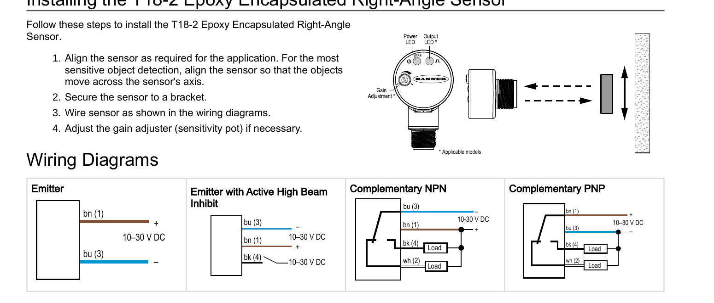

# YieldFlo Optical Sensor — Purchase & Wiring Guide

Elevator flow sensor for the YF1 module: a Banner T18-2 emitter/receiver pair mounted
opposed across the clean-grain elevator, wired to J7 on the YF1 board.

---

## 1. What to buy

The PNP/complementary variant matches the YF1 board's PC817 input circuit and is the
common choice for this kind of aftermarket elevator sensor install.

| Qty | Part | Role | Notes |
|---|---|---|---|
| 1 | **T18-2NAEL-Q8** | Emitter | Visible red, 2-wire (Brown/Blue power only, no signal) |
| 1 | **T18-2VPRL-Q8** | Receiver, PNP | 4-wire, complementary sourcing outputs |
| 2 | **MQDC-406** | M12 5-pin cordset | One per sensor — connects Q8 sensor to the harness |

DigiKey links (from the folder):
- Emitter: https://www.digikey.ca/en/products/detail/banner-engineering-corporation/T18-2NAEL-Q8/10652999
- Receiver: https://www.digikey.ca/en/products/detail/banner-engineering-corporation/T18-2VPRL-Q8/10654084
- Cordset: https://www.bannerengineering.com/us/en/products/part.45136.html

**Simpler alternative** — skip the separate cordsets and buy the sensors with cable
already attached (9 m pigtail, straight into the harness):

| Qty | Part | Role |
|---|---|---|
| 1 | T18-2NAEL-9M | Emitter, cable attached |
| 1 | T18-2VPRL-9M | Receiver PNP, cable attached |

Either way you end up with the same 4 wires per sensor (2 for the emitter, 4 for the
receiver, of which 2 are unused on the emitter). Datasheet on file: `201875.pdf`.

---

## 2. Sensor wiring (M12 pinout, both sensors)

| Pin | Wire | Function |
|---|---|---|
| 1 | Brown | +12V supply |
| 2 | White | Complementary output (receiver only — opposite of Pin 4) |
| 3 | Blue | GND |
| 4 | Black | Main output (receiver only) |

The emitter only uses Brown (+) and Blue (–) — it has no signal pins.

Straight from the Banner datasheet (p. 2 of `201875.pdf`), the **Emitter** and
**Complementary PNP** wiring diagrams — this is the diagram to build the harness from:



Confirms the pinout above: Emitter bn(1)=+, bu(3)=–. Receiver (Complementary PNP)
bn(1)=+, bu(3)=–, bk(4)=Main output (Load), wh(2)=Comp output (Load).

---

## 3. Mounting — opposed beam across the elevator

Emitter and receiver mount on **opposite sides of the clean-grain elevator**, aimed
directly at each other so paddles interrupt the beam as they pass. This is the standard
opposed-beam layout used by aftermarket elevator yield sensors generally:

- Mount **as high up the clean grain elevator as reasonably possible** — ideally in the
  top third, before the elevator enters the grain tank — and **centered on the paddles**
  of the chain, not between them.
- Drill/mount one sensor on the front face, the other directly opposite on the back
  face, so the beam passes straight through the paddle path.
- Confirm no paddle sits directly behind the hole before drilling — advance the chain by
  hand if needed.
- Clean the mounting surface (alcohol wipe) before fixing the sensor — oil/grease on the
  elevator wall stops adhesive-backed mounts from curing properly, and throws off
  alignment on bolted mounts too.
- Sensor windows must stay clean (dust/oil degrades the beam) — wipe with a dry optical
  cloth, then 70% isopropyl alcohol if needed, same as the Banner datasheet's
  maintenance note.
- starting on page 7 of 201875.pdf there is additional mounting hardware

---

## 4. Wiring into the YF1 (J7, DT13-12PA, 12-pin)

J7 is the main vehicle harness connector on the YF1. Relevant pins for the optical
sensor pair:

| J7 Pin | Signal | Connects to |
|---|---|---|
| 1 | 12V Out | Both sensors — Brown (Pin 1) |
| 3 | MainSignal | Receiver — Black (Pin 4) |
| 7 or 8 | Chassis/Sensor Ground | Both sensors — Blue (Pin 3) |
| 11 | CompSignal (optional) | Receiver — White (Pin 2), if used |

The emitter only needs pins 1 (+12V) and 7/8 (GND) — its Brown/Blue wires.

```
Emitter (2-wire)                         J7
  Brown (1) ───────────────────────────► Pin 1  (12V Out)
  Blue  (3) ───────────────────────────► Pin 7  (GND)

Receiver (4-wire, PNP)                   J7
  Brown (1) ───────────────────────────► Pin 1  (12V Out)
  Blue  (3) ───────────────────────────► Pin 8  (GND)
  Black (4) ───────────────────────────► Pin 3  (MainSignal)
  White (2) ───────────────────────────► Pin 11 (CompSignal, optional)
```

**CompSignal is optional.** MainSignal (Black) alone is enough to run the sensor — the
firmware supports a Main-only mode. Wiring both gives noise rejection (an edge is only
counted when Main and Comp flip together, which discards single-wire glitches), so wire
White to pin 11 if the extra conductor is easy to run. If it isn't — e.g. only 2 wires
reach the sensor location from the cab, or a shared/existing harness doesn't carry the
White wire — leave CompSignal unconnected and configure Main-only; this is a supported,
proven configuration, not a fallback hack.

### Board-side note

The YF1's PC817 input stage (U6/U7) is built for this PNP sensor: R8/R9 = 560Ω on the
cathode-to-GND side, with a 10kΩ pull-down on each signal net, per the sensor-interface
section of `module_design_notes.md` in the repo. No firmware changes are needed for a
straight T18-2 install — this is the same PC817 input stage the receiver's Black/White
outputs already drive on the current board revision.

---

## 5. Quick reference — full parts list

| Item | Qty | Part | Source |
|---|---|---|---|
| Emitter | 1 | T18-2NAEL-Q8 (or -9M w/ cable) | DigiKey |
| Receiver, PNP | 1 | T18-2VPRL-Q8 (or -9M w/ cable) | DigiKey |
| M12 cordset | 2 | MQDC-406 | Banner / Digi-Key (skip if using -9M sensors) |
| Mounting bracket | 2 | SMB18A (or SMB18FA.. for swivel adjustment) | Banner — optional, see §3 |
| Gasket kit | 1 | ACC-T18-2-GSK-FDA-10 | Banner — optional, see §3 |

**Sources in this folder:** `201875.pdf` (Banner datasheet) 
